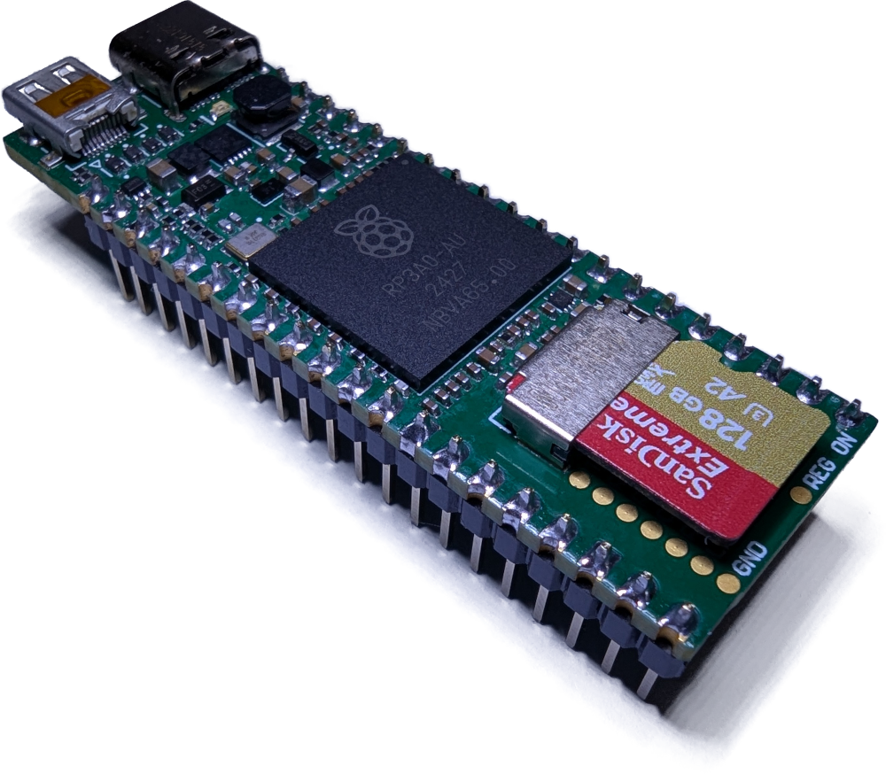

# RP3A0 reverse engineering

This contains my attempts at reverse-engineering the RP3A0 SoC from the Raspberry Pi Zero 2W so I can place it on my own PCB.

I plan to eventually use this in another project, but for now I need a proof of concept. I decided to make the most cursed thing I could think of, Pi Pico sized board, but with a full Raspberry Pi processor on it. It has basically the same pinout as a Pi Pico, all the GPIOs that match up are in the same position. HDMI is sketchy, there's no Wi-Fi, and USB-C is a bit weird, but it boots and I can get it online. Check the [`breakout/rp3a0_mini`](breakout/rp3a0_mini) dir for this.

## Documentation:
* [`docs`](docs) - The pinout of the RP3A0 SoC, and how I reverse engineered it
* [`docs/reballing`](docs/reballing.md) - How to harvest the RP3A0 from a Raspberry Pi Zero 2W and prepare it for soldering onto a PCB
* [`breakout/rp3a0_mini`](breakout/rp3a0_mini) contains an Altium project for the RP3A0 Pico, a carrier board in almost the same form factor as the Pi Pico
* [`library`](library) contains an Altium library with the SoC footprint and the outline of the castellated pads for a Pi Pico

## Disclaimer
This was a stupid idea and you probably shouldn't do it. There are heaps of other Linux SoCs you can use, an especially ones that aren't a 21x21 BGA device with no public documentation. It's also not super easy to solder, so you might trash a couple parts trying to get it right.

## Thanks to...
* My coworkers for putting up with me asking questions about BGA reballing and PCB design
* Jeff Geerling ([YouTube](https://www.youtube.com/c/JeffGeerling), [website](https://www.jeffgeerling.com/)) for:
  * his blog post with an [X-Ray of the Pi Zero 2W](https://www.jeffgeerling.com/blog/2021/look-inside-raspberry-pi-zero-2-w-and-rp3a0-au) that inspired this project
  * being cool when I ambushed him at Open Sauce 2025 to show him my crazy project
  * being the first person to test out my prototype board, giving me feedback and providing some great photos for me to use
* Raspberry Pi for making such a great little SoC, and at least releasing _some_ schematics for it