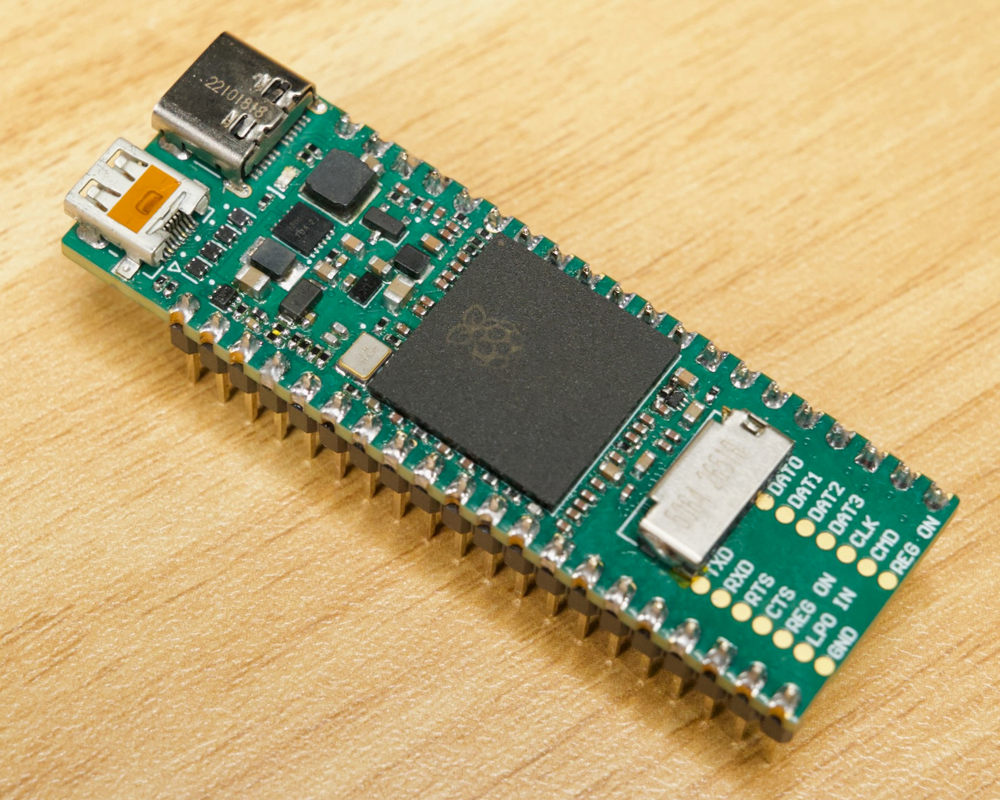

# RP3A0 Pico

This contains the Altium project for the RP3A0 Pico, a Pi Pico sized board with the RP3A0 SoC on it. 

## Goals
* Prove that I have the RP3A0 SoC pinout
* Create a board that could actually be useful where you need a more powerful processor in a small form factor
* Staying close to the Pi Pico form factor, with the same castellated pads and no parts on the underside

## Errata v1.1
This is definitely a V1 - this is the first board I've had built of this design.  
* I spent no time on the HDMI, so it doesn't work super well. I have managed to get 1080p@60Hz video out of it, but it didn't work well on some monitors. With some proper trace layout and impedance matching it should work better.
* The ports are far too close together, but I didn't have enough space if I wanted to keep the same width as a Pico. In the next revision I'm going to try out rotating the HDMI connector 90 degrees to point out the side.
* There is no Wi-Fi or Bluetooth. There's not a huge amount of space on the board, but I left test pads for all the signals from the RP3A0. It may be possible to transfer over the layout from the Pi Zero 2W but there would be no space for an on-board antenna. The part is a finer pitch than the RP3A0, so reballing it will be difficult.
* The ID pin that would normally go to the micro USB connector is only connected to a test pad on the underside. I'm not sure if this makes a big difference in reality, since I've been able to use it as a USB host just fine. In case you do need the functionality, you can bridge the pads of J4 on the bottom side to connect ID to GND.
* I haven't tested this in any Pi Pico breakout boards, so there's a chance some pins don't match up. I'd recommend checking the pinout against the schematic of the breakout board before plugging it in.
* I didn't connect VSYS to VBUS with a diode, so the 5V pin (pin 40) goes directly to the 5V rail. There's no overvoltage or reverse polarity protection. Also I didn't connect pin 39 (labelled VSYS on a Pico) to anything, so if something takes power from it, it won't work. You could bridge them together with solder.
* Not all the values on the schematics are correct, I've tried to update the BOM CSV with the notes I took when building the board

## Important links
* Schematic PDF - [outputs/rp3a0-pico-schematics-v1.1.pdf](outputs/rp3a0-pico-schematics-v1.1.pdf)
* Draftsman PDF - [outputs/rp3a0-pico-draftsman-v1.1.pdf](outputs/rp3a0-pico-draftsman-v1.1.pdf)
* Gerber files - [outputs/rp3a0-pico-gerbers-v1.1.zip](outputs/rp3a0-pico-gerbers-v1.1.zip)
  * I had this built by JLCPCB, remember to add the option for castellated pads on two sides.
* BOM CSV - [outputs/rp3a0-pico-bom-v1.1.csv](outputs/rp3a0-pico-bom-v1.1.csv)
