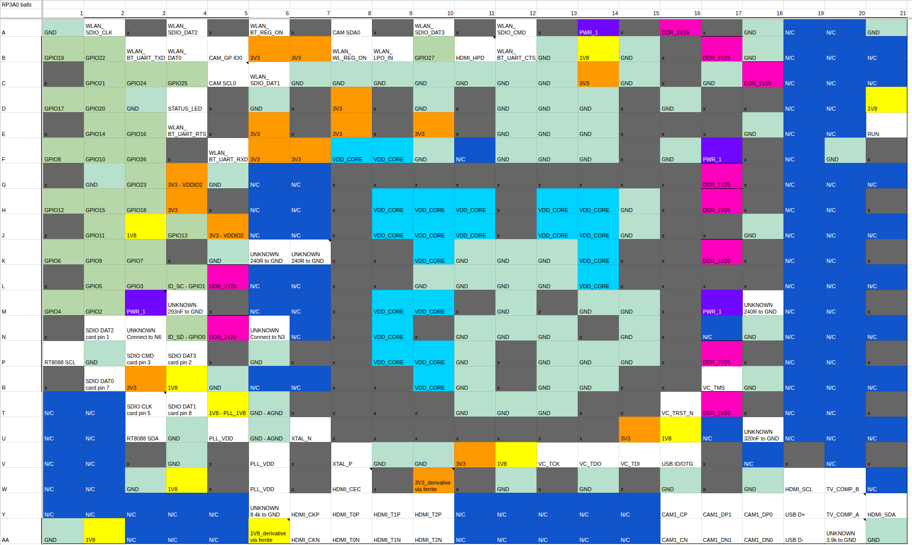
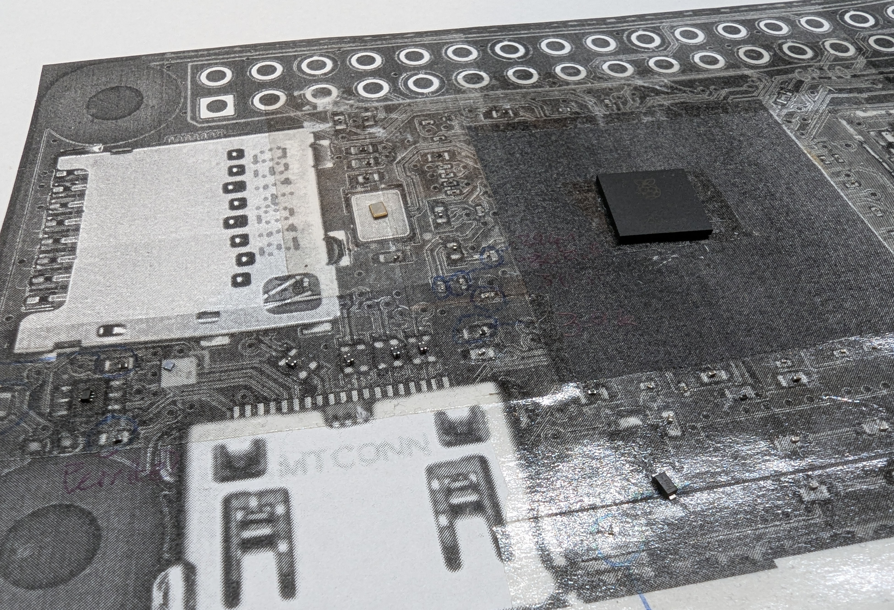
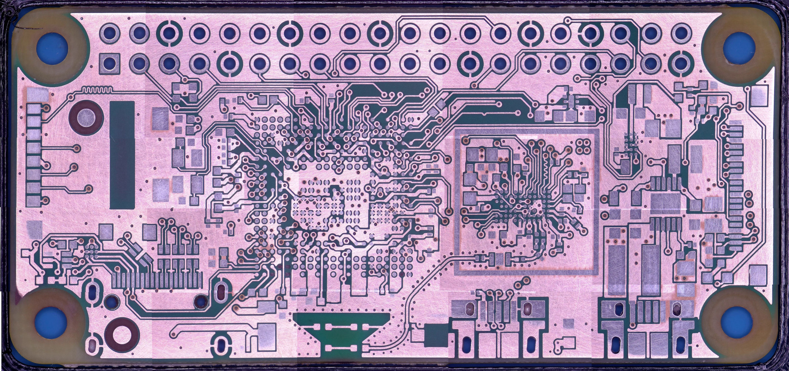

# Reverse engineering the RP3A0

## tl;dr - RP3A0 pinout

The RP3A0 a 21x21 BGA package with 0.65mm pitch, outside dimensions are 15x15mm. I haven't measured the pad size accurately, but I'm using 0.3mm solder balls when reballing it.

Here's the pinout of the RP3A0 SoC (as far as I can tell). All the names here are ones I've given to the pins. They're labelled as to what they do on a Pi Zero 2W, not what the function is internally.

You can check out the Google Sheet with the pinout here: [RP3A0 balls](https://docs.google.com/spreadsheets/d/1cQo1mM0g4L-HjAe8-86Zw-xbBoLv0I49Cb5mO69Yzt8/edit?usp=sharing) or check the schematics for my breakout board [`breakout/rp3a0_mini/outputs/rp3a0-pico-schematics-v1.1.pdf`](../breakout/rp3a0_mini/outputs/rp3a0-pico-schematics-v1.1.pdf).

There are a bunch of unknown pins, so all I've done is hooked them up in the same way that they are on the Pi Zero 2W. The reduced schematics that are published do show some pins on the SoC, so those were easy to label.

Note: Pins on a BGA are denoted with a letter and a number, where the letter is the row and the number is the column. BUT, not all letters are used when labelling BGA pins to avoid confusion. The letters `I, O, Q, S, X and Z` are skipped, and then it rolls over to `AAx`, `ABx`. This confused me at first when the reduced schematics had the crystal connected to U7 and V8 but from my pinout it was on Q7 and R8. 

Want to learn how to solder the RP3A0? Check out [reballing the RP3A0](reballing.md)

## Why?
There's another project I've been working on for years (that I'll probably document at some point in the future), but I wanted to add a linux processor to it. 
However it's pretty space constrained and I didn't want to have to do traces for DDR, so I was looking for an SoC that had a decent amount of RAM baked in, or a decent SoM. Unfortunately, most SoMs I found have parts on the other side as well, meaning I'd have to have a cutout in whatever board I was putting it on.

Here's a few of the options I was looking at:
* Allwinner F1C100s/F1C200s SoC
  * QFN package is easy to solder 
  * Doesn't have a huge amount of RAM (32MiB/64MiB)
* Rockchip RV1103/6 SoC
  * QFN package is easy to solder
  * Has a decent amount of RAM (128MiB)
  * Not a lot of software support, but I could probably get it working
* MangoPi mCore-R818 SoM
  * Powerful, heaps of RAM
  * Has parts on the other side so needs a cutout in the board
  * Pretty big at 32x32mm, hard to find that much space in a square in the form factor I need
* Pi Compute module
  * Very powerful
  * Gets pretty thick with the connectors
* Raspberry Pi Zero 2W
  * Fairly powerful
  * VERY well supported
    * Easy to build a kernel for it
    * Heaps of software support
  * Won't fit at all in the space I have
  * If only I could use the processor on its own...
* RP3A0
  * Fairly powerful
  * Has 512MiB of RAM baked in
  * VERY well supported
  * Only reduced schematics available
  * 21x21 BGA package, not easy to solder
  * Only available on the Pi Zero 2W
  * Sounds like a fun challenge though

## Equipment I used
* Hot air rework station: anything will be better than what I've got
* Soldering iron: Hakko FX-888D
* Flux: Chipquik NC191
* Hot plate: I got this one from AliExpress: [link](https://www.aliexpress.com/item/1005005576574932.html). I haven't tried the smaller USB-C powered ones, this one is pretty good, though it has some serious thermal mass so it takes a little bit to heat up, but also takes FOREVER to cool down.
* Microscope: I can't find the exact one I bought, but again from AliExpress: [link](https://www.aliexpress.com/item/1005008174025268.html). Having both HDMI and USB was super useful for this project. The HDMI output is much lower latency, so it's totally possible to look just at my monitor when soldering under it. The USB output just shows up as a webcam on a computer, so I used VLC to stream the video feed and used that to capture screenshots.
* Sandpaper: I used 800, 1200 and 2000 grit, but you could probably get away with just 800 and 1200
* Glass plate: I used an old glass 3D printer bed, but any flat piece of glass will do
* Tweezers: Mine are the ones that come in the iFixit Pro Tech Toolkit

## How?
There are only [reduced schematics](https://datasheets.raspberrypi.com/rpizero2/raspberry-pi-zero-2-w-reduced-schematics.pdf) available for the Pi Zero 2W, which fortunately gives all the details about the power supplies, but not much else. To figure out the rest I was going to have to follow the traces on the PCB. Unfortunately, it's a 6-layer PCB, so there's going to be a lot that I can't figure out without going in deeper. If I had a CNC mill I might have tried to use that to shave down the board, but surely just using sandpaper won't take too long, right?

I wanted to be able to keep track of all of the different parts on the board, just in case I needed to re-use or re-measure any of them. I printed out a photo of the board and covered it in double-sided tape, and put each part I took off the board back onto the same location on the board. I used hot air to remove the parts at the start, but it was definitely harder than expected given the lead-free solder that's used. I managed to pull some pads off the board when taking the SoC off, fortunately they weren't connected to anything. Later on in the project I bought a small hot-plate that made taking parts off MUCH easier.

My highly sophisticated parts organisation system. Some of passives are tiny 0201 packages, I definitely lost a few of them while trying to measure them, so I had to take a guess.

I started off with some other boards that I had lying around to test out the process. I figured I needed a super flat surface to start with, so I used an old glass 3d printer bed I had. I bought 800, 1200 and 2000 grit sandpaper from the hardware store, along with some gloves since I knew it was going to get messy. Since it's sanding fibreglass, you should be more careful than I was and wear a mask. Since I was wet sanding it didn't create a lot of dust in the air.
I cut out bits of the sandpaper, taped it down to the glass, wet the sandpaper and started sanding the board. At first I just needed to get through the soldermask on both sides to get a better look at the traces underneath, and that only took a couple minutes before all I had was bare copper.

To then get an image of the copper, I tried the flatbed scanner that's in my Brother printer, but it's resolution wasn't great. I probably could have worked out the traces from it, but it was still pretty blurry. The microscope I have only has a 27mmx15mm field of view at the lowest magnification, so I couldn't get a full image of the board at once. I ended up making a simple jig to hold the board in place with notches in it so I could move the board between the notches reliably to take a photo of one horizontal segment. Then I moved the board down a little bit leaving an overlap of about a third of the board, and took captures of the next horizontal segment.
I tried a bunch of tools that could supposedly do all the stitching for me, like Hugin and https://github.com/OpenStitching/stitching. However, I just couldn't get anything to work reliably, and I was spending more time than it would have taken me to just stitch it myself. Instead, I imported each image into GIMP then used the Unified Transform tool to rotate/scale/change perspective of each image to line up the vias from the microscope image with the vias in the image from the flatbed scanner. 

I changed between the sandpaper as I went depending on how much material I needed to remove. Usually the 800 grit was fine. It's quite a slow process, and also quite hard to get the board to sand down evenly. I was checking the board every so often, and if it was wearing unevenly I'd apply more pressure to an area, or even give the board a bit of a bend. It would keep its shape just enough focus on a particular area without sanding down areas that were already well exposed.

## Results
The process was very slow - I ended up sanding and capturing one layer per night after work. But the results are worth it! After stitching all the images together, I ended up with a full set of 6 layers of the Pi Zero 2W PCB. The stitching isn't perfect, but the main thing I wanted was to reliably have all the vias lined up so I'd be able to follow the traces between layers. I also made sure to capture the top layer with the soldermask sanded off, so I could see all the traces and pads clearly.

High resolution layers - (~5MB JPGs)!
* [Top with soldermask and silkscreen](images/layer_1_soldermask.jpg)
* [Layer 1](images/layer_1.jpg)
* [Layer 2](images/layer_2.jpg)
* [Layer 3](images/layer_3.jpg)
* [Layer 4](images/layer_4.jpg)
* [Layer 5](images/layer_5.jpg)
* [Layer 6](images/layer_6.jpg)
* [Bottom with soldermask and silkscreen](images/layer_6_soldermask.jpg)
