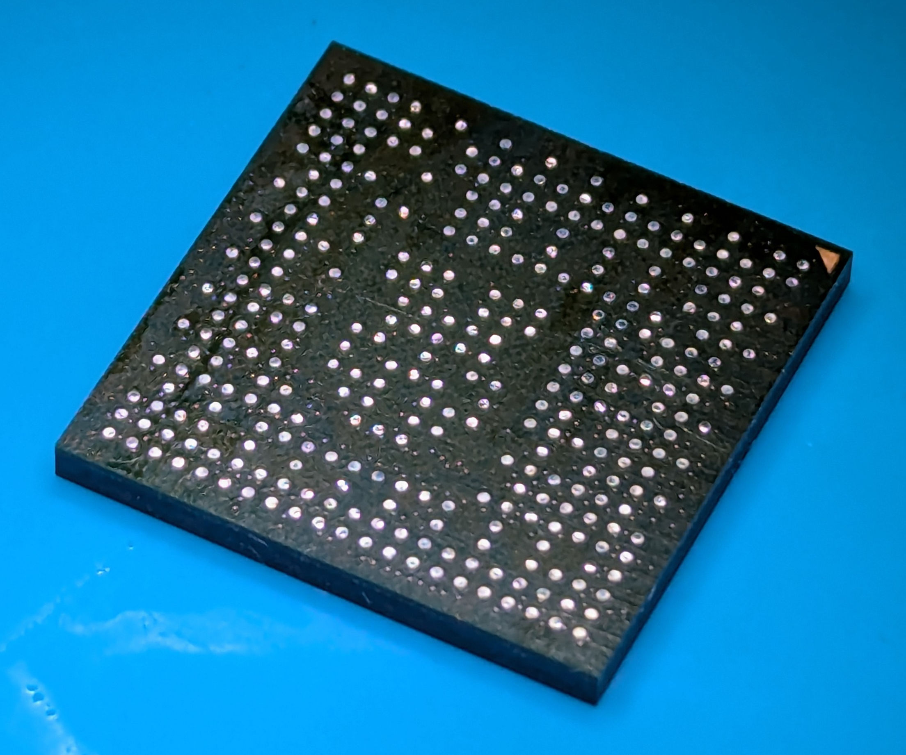
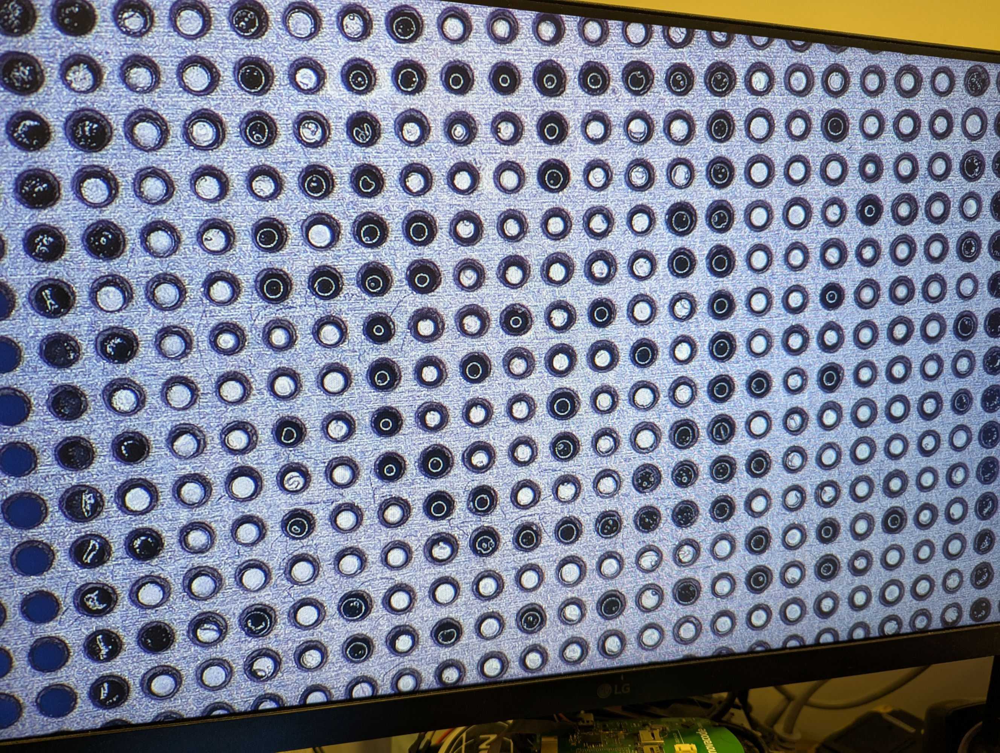
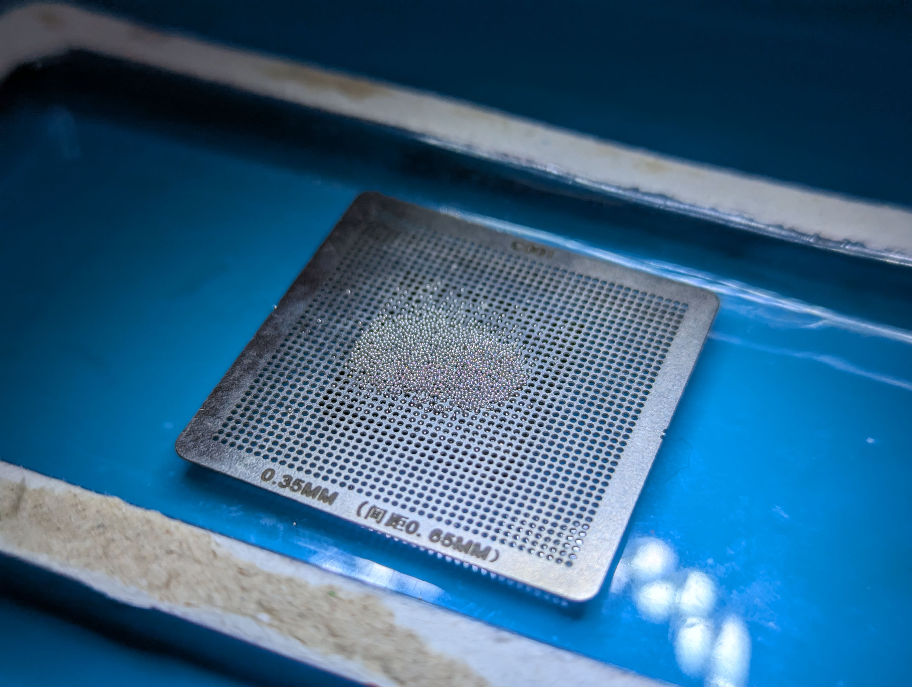
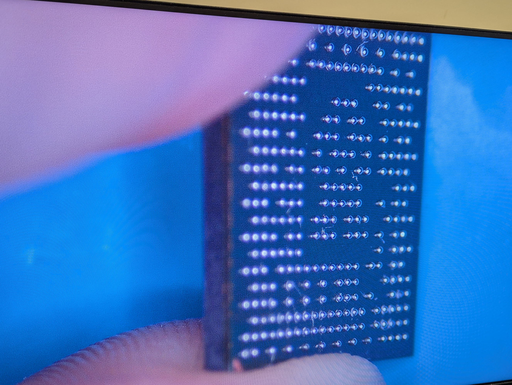

# Harvesting and reballing the RP3A0 SoC

## Can I just buy the RP3A0?
No, you can't. The RP3A0 is not available for purchase separately, but you can harvest it from a Raspberry Pi Zero 2W.

## Harvesting the RP3A0
This is the process I followed. It might not be the best way to do it, but it worked for me. Don't @ me complaining about all the Pi boards you destroy trying to do this.

You're going to need:
* A hotplate or a hot air rework station
  * I used hot air for this initially, but once I got the hotplate, I found it much easier. The tiny USB-C powered ones are probably good enough
* A good soldering iron
* Good flux - e.g. Chipquik NC191
* Solder wick
* Tweezers and/or a vacuum pickup tool
* Solder balls - 0.3mm for the RP3A0. Make sure it's leaded solder, lead-free is much harder to work with
* Solder
* A reballing stencil - 0.65mm pitch, 21x21 BGA, 0.3mm balls
  * You could use one of those fancy ones that holds the IC in and collects all the solder balls, but I just used a small stencil from a pack on AliExpress 
* A microscope is super useful
* A donor Pi Zero 2W

1. Put the Pi Zero 2W on the hotplate and heat it up to about 230C. Adding some flux to the SoC should help it come off easier. If you're using hot air - you're going to need a lot of heat. Go slowly and try not to rip any pads off.
2. Use some tweezers or a vacuum pickup tool to try and lift the SoC off the board. 
3. Turn the hotplate off and let the SoC cool down.
4. Add some flux to the bottom of the SoC and clean up the solder off the pads with solder wick. Adding some leaded solder to the pads will make this easier. Make sure all the pads are clean and have no solder on them.

It should look something like this
5. Apply a VERY thin layer of flux to the bottom of the SoC, and then place it on the stencil. Line up the holes in the stencil with the pads on the SoC.

6. My flux was tacky enough to hold the stencil in place, but if yours isn't, you can use some tape to hold the SoC in place.
7. Find a shallow dish to put the stencil in. This is to catch all the solder balls that fall out.
8. Put the stencil in the dish with the holes facing up, and sprinkle some solder balls into the holes. Shake the stencil gently to spread the balls out. A card is also useful here to distribute them, but it also makes it easy to feel where there are two balls in one hole.

9. You should only have one ball in each hole. If there is more than one, you'll end up with a pad that's got too much solder on it, and it will either lift the part up so it doesn't solder correctly, or cause a short.
10. Put the SoC (still stuck to the stencil) on the cold hotplate with the balls up, and turn the hotplate on to about 200C. You should see the solder balls melt and drop into place. If any don't drop into place, you may be able to carefully poke them in with tweezers. If the flux bubbles up and sends the balls everywhere, then you put too much flux on and you'll need to start again.
11. Once all the balls are in place, turn the hotplate off and let it cool down.
12. VERY carefully peel the stencil off the SoC. Don't force it if it's not coming, you may be able to heat it up a little bit to make the flux more liquid.
13. Inspect the SoC to make sure all the balls are in place and there are no shorts. If there's a ball missing, you're going to have to start again.
14. There will likely be some balls stuck to the SoC with flux that aren't supposed to be there. Using a little bit of Isopropyl alcohol and a toothbrush, gently brush the bottom of the SoC to remove them. You can refer to the pinout above to see which pads are supposed to have solder.

Great, now you have a re-balled RP3A0 SoC!

## Soldering the RP3A0

1. Clean the pads on the PCB, if there's solder, clean it all off with solder wick.
2. Add a small layer of flux to the area
3. Place the RP3A0 on the pads, making sure to line it up as close as you can. When reflowing it will move into place, but only if it's close in the first place.
4. Put the PCB on the hotplate and turn it on to about 200C.
5. As it heats up, keep an eye on it. The flux should start bubbling and smoking, then hopefully the RP3A0 will jump into place. 
6. If you want, you can VERY carefully give it a little poke with tweezers to check it's in place. If it is, turn the hotplate off and let it cool down.
7. Good luck! If it didn't work, then you get to do it all again.
